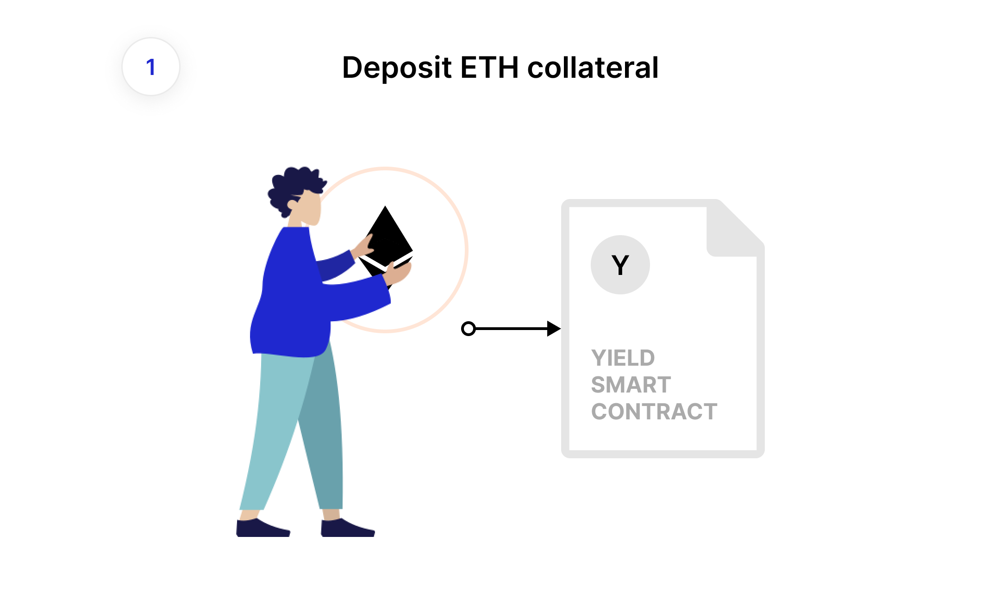

# Borrowing

You can begin borrowing by accessing the [Yield v2 App](https://app.yieldprotocol.com/#/borow). Read our [Quick Start Guide NEED LINK]() for instructions. 

Borrowing on the Yield Protocol is a simple three step process. You choose an asset you want to borrow, you add collateral, and you review and initiate the transaction. 

The fixed interest rate you receive when borrowing is determined by a built-in automated market, and the more you borrow, the higher your interest rate may be. All loans in Yield require overcollateralization with a greater value of collateral than debt. If you do not maintain a sufficient amount of collateral in your vault at all times, your vault may be liquidated.

Yield permits you to borrow at a fixed rate for a fixed term, but you may repay early if you choose. Repaying early may result in you not receiving your original fixed rate, so give some consideration to how long you plan to have the loan when determining which maturity to borrow. 

## Borrowing Under the Hood

To borrow, you deposit collateral in the protocol and draw new fyTokens against the collateral. You may proceed to sell the fyTokens for the underlying token, locking in your borrowing rate. Yield Protocol has a built-in automated market maker(AMM) called YieldSpace to enable efficient selling of fyTokens.

At maturity, you must repay the debt to reclaim your collateral. Of course, you may also repay your debt earlier than the maturity by returning the fyTokens you have drawn. Interest rate changes may affect (positively or negatively) the amount of the borrowed asset you need to spend to obtain the needed fyTokens. Be careful when repaying earlier as you may incur higher interest rates than paying at maturity.

After maturity, if you don't close your borrowing position, floating-rate interest will be charged to keep the position open.

  |  
:-------------------------:|:-------------------------:
  |  

### Example

To borrow Dai, as a user you have to buy fyDai
(for users of the Yield App, the buyer will in practice be [YieldSpace](developers?id=yieldspace-contracts), Yield's application specific automated market maker). Assuming ETH is \$400

1. You deposit 0.5 ETH of collateral (worth $200) in the system. This allows you to borrow up to 132 fyDai from any of the available maturities. 
1. You decide on Sept. 31, 2021 to borrow 100 fyDaiDec21 (fyDai expiring on December 31, 2021).
1. You sell the fyDaiDec21 on the open market for 98.79 Dai.

Effectively, you have borrowed 98.79 Dai today and have 100 Dai debt, due in 3 months. In other words, you have borrowed at 5% APR. We can show this by plugging our values into the [present value formula](https://www.investopedia.com/terms/p/presentvalue.asp) and solving for ***r*** to calculate our interest rate (we use 0.25 in the exponent because 3 months = 1/4 of a year):

$$
0.9879 = \frac{1}{(1 + r)^{0.25}} \leftrightarrow r = (\frac{1}{0.9879})^{4} - 1 = 0.0499
$$

After maturity is reached on Dec. 31st, 2021, you may return and pay the 100 Dai debt and get back your collateral.

### Maturity

After maturity, the Yield Protocol does not require that you pay back your debt immediately. 

Instead, it will charge you the variable interest rate fees based on the underlying asset you borrowed and collateral you used.

<!-- TODO: Need to expand upon how fees is actually charged -->

Due to that, you may want to close your position as soon as possible or incur higher debt due to the variable interest rate fees. If your debt grows beyond your allowed collateralization ratio, you will be [liquidated](developers?id=liquidations).

### A note on collateral

Borrowers must maintain a minimum amount of collateral in the system to secure the debt they owe. 

If a borrower fails to do so, they may be liquidated: their collateral will be seized and auctioned off to repay their debts. 

<!-- For ETH collateral, fyDAI uses the same collateralization ratio as MakerDAO, which is currently 150%. -->

<!-- TODO: Need to expand upon what ratio will be used for different collateral and different assets -->