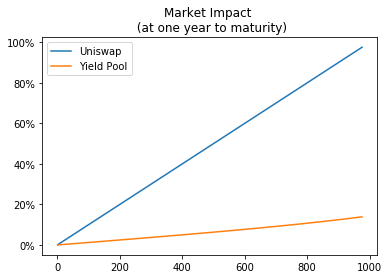

# Pooling Liquidity

Yield Protocol v2 relies on users called liquidity providers to provide essentially liquidity for borrowers and lenders. 

To provide liquidity, you first access the "Pool" tab in the [Yield v2 App](https://app.yieldprotocol.com/#/pool). Read our [Quick Start Guide](https://medium.com/yield-protocol/yield-protocol-v2-quickstart-guide-e516a955a405) for instructions. 

Yield Protocol v2 has an improved the experience for providing liquidity. Users now contribute liquidity to strategies that support one Yield liquidity pool at a time. Pooling your liquidity earns you fees from borrowers and lenders. When the liquidity pool’s maturity date is reached, strategies automatically rollover liquidity from one pool to a later pool and require no user intervention.

The various liquidity strategies rollover in a predefined way. The “three month” pool always rolls liquidity to the nearest dated pool. The six month pools, JD and MS, roll between predefined liquidity pools. The A pool rolls between the March and September series pools, and the B pool pool rolls between the June and December pools.  

## YieldSpace Automated Liquidity Pools

While fyTokens are ERC-20 assets and can be traded using existing protocols like Uniswap, those protocols are not optimized for fyTokens. To improve the liquidity of fyTokens, Yield has designed a new automated liquidity provider that is designed to enable efficient trading between fyTokens and their underlying assets. We call this new automated liquidity provider YieldSpace. You can read more about it in our [YieldSpace Whitepaper](https://yield.is/YieldSpace.pdf) to get a deeper understanding of the calculations and the overall mechanism. The Yield App integrates YieldSpace seamlessly into the user experience.

YieldSpace pools improve on existing solutions by providing markets that quote at consistent interest rates over time, in the absence of trades. By quoting at a consistent interest rate, YieldSpace pools minimize losses from arbitrage.

Whereas in Uniswap, arbitrage trades are expected whenever prices change, arbitrage trades in the YieldSpace Pool are expected to occur only when interest rates change. This should tend to reduce the “impermanent loss” suffered by market makers.

Like other automated liquidity providers, users may choose to provide liquidity to YieldSpace pools to earn fees from future trades. YieldSpace uses a custom fee model that is optimized for fyTokens. Rather than charge a fee that is a percentage of the amount of the asset bought or sold, YieldSpace charges a fee that is proportional to both interest rate and time to maturity. This fee model ensures that fees never result in the unreasonable amount on interest rates paid by borrowers (fyToken sellers) and earned by lenders (fyToken buyers).

Similar to Uniswap v2, providing liquidity to YieldSpace will grant you Liquidity Provider shares. If you are providing liquidity for fyDai21Sep30, you get fyDaiLP21Sep30 tokens which represent your share of the pool. These tokens are ERC-20 tokens and may further be composed in the Defi ecosystem.

Each fyToken has an associated YieldSpace pool that permits trading between that fyToken and its underlying asset. Swapping fyTokens with different maturities needs to be done manually.

### Market Impact
The Yield Pool formula reduces the market impact suffered by traders of fyToken, especially for fyToken that is closer to maturity. The chart below illustrates the market impact that trades of equivalent size would cause on Uniswap versus the Yield Pool, assuming both are initialized with reserves of 1000 Dai and 1000 fyDai.

The x-axis is the amount of fyDai sold. The y-axis is the implicit interest rate achieved by a borrower who is selling that amount of fyDai at one year to maturity. Borrowers obtain considerably better fyDai/Dai quotes (with better implied interest rates) by using the Yield Pool.

 
YieldSpace consistently outperforms Uniswap on both interest rates and market quotes</figcaption>